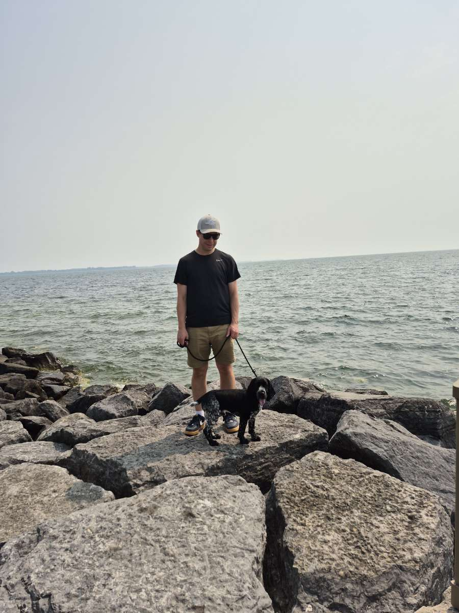

::: {.columns}
::: {.column width="68%"}

I am a Ph.D. Candidate in Computing at Queen's University and a researcher in the [GOAL Lab](https://goal-soc-queensu.github.io/), working at the intersection of **causal inference, machine learning, Bayesian modelling, and simulation.** 

My research focuses on how causal structure can be learned from data and used to build artificial intelligence systems that are more robust, interpretable, and capable of reasoning about interventions. A recurring question across my work is how we can move beyond predicting what is likely to happen toward understanding **why it happens and what may happen if we actively change the system.**

This motivates my work on causal discovery, causal forecasting, intervention reasoning, uncertainty quantification, and agent-based modelling, with a broader interest in developing AI systems that can reason about the consequences of actions rather than only recognize statistical patterns.

:::

::: {.column width="32%"}

{fig-alt="Brandon Mossop" width="100%"}

:::
:::

## My academic path

My academic path began in Civil Engineering at Lakehead University. After graduating, I spent about four years working in the oil and gas sector in Alberta. During that time, however, I became increasingly interested in computer programming and artificial intelligence.

A major turning point came when I read Douglas Hofstadter's *Gödel, Escher, Bach* (GEB). Like many researchers who have been drawn to artificial intelligence by the book, I found its exploration of intelligence, computation, self-reference, and the nature of thought fascinating. It left me wanting to understand these ideas more deeply and ultimately convinced me to pursue computer science.

I returned to Lakehead University to study Computer Science, and then continued into a master's degree specializing in Artificial Intelligence. During that period, my interests gradually shifted from conventional machine learning toward questions about how AI systems can reason about the underlying mechanisms that generate data rather than simply learn statistical patterns from it.

Another book played an important role in that transition: Judea Pearl and Dana Mackenzie's *The Book of Why*. Its treatment of causality, intervention, and counterfactual reasoning had a similar impact on me to *Gödel, Escher, Bach*. It introduced me to the idea that there is a fundamental difference between observing that two things are associated and understanding what would happen if we actively changed one of them.

That interest eventually led me to my current doctoral research in Computing at Queen's University, where I study causal structure learning and its use in building more robust, explainable, and intervention-aware artificial intelligence systems.

## Beyond research

Outside of research, I am an enthusiastic sports fan and enjoy both watching and playing. I follow Liverpool FC and the Miami Dolphins, and I particularly enjoy playing soccer and tennis, as well as running.

I am also an avid reader, especially of popular science and books that explore big ideas about mathematics, physics, cognition, and intelligence. Some of my favourite authors include Brian Greene and Douglas Hofstadter. I think that Brian Greene's *The Elegant Universe* was the first non-fiction book that made me realize that science can be as strange and fantasical as fiction. And I already mentioned how Hofstadter's *GEB* inspired my original pursuit of AI. I am similarly fascinated by the work of M. C. Escher, particularly the way his art plays with geometry, perspective, infinity, and our perception of space.

Another long-standing interest of mine is urban planning. I am interested in how we can design communities that are more connected, walkable, healthy, and enjoyable places to live. This also overlaps with my professional interests: I am particularly interested in how simulation, agent-based modelling, and other computational approaches can help us understand how planning and policy decisions shape cities and communities over time.

## Elsewhere

[GitHub](https://github.com/bdmossop){target="_blank"}

[Google Scholar](https://scholar.google.com/citations?user=MAJ99A8AAAAJ&hl=en&oi=ao){target="_blank"}

[ORCID](https://orcid.org/0009-0000-6017-8079){target="_blank"}

[LinkedIn](https://www.linkedin.com/in/brandon-mossop-1a27b799/){target="_blank"}

[Email](mailto:brandon.mossop@queensu.ca)

